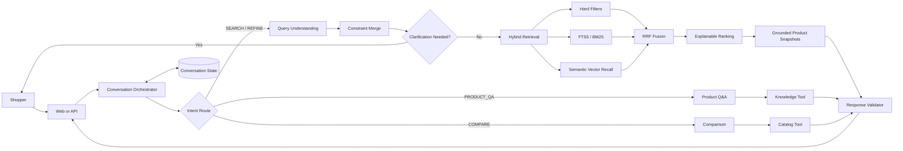

# ShopGuide Agent

ShopGuide Agent is a conversational product discovery and decision-support system for ecommerce. It helps shoppers move from an imprecise request to a shortlist of products without requiring them to know exact product names, catalog fields, or filter syntax.

A shopper can say:

> I need a laptop under CNY 5,000 for programming and occasional video editing. It should be lightweight.

ShopGuide identifies the product category and intent, converts the request into validated search constraints, decides whether one clarification question is useful, retrieves eligible products, ranks them against the shopper's priorities, and returns grounded recommendations with product IDs, prices, stock, ratings, and match reasons. The shopper can then refine the same search, compare displayed products, or ask an evidence-backed product question without restarting the conversation.

The project demonstrates how an AI application can combine model-based language understanding with deterministic business rules, hybrid retrieval, stateful Agent orchestration, constrained tools, and grounded response validation. It includes an OpenAI-compatible inference integration and remains runnable without provider credentials through a deterministic fallback path.

## What the Project Delivers

- **Natural-language product search** across laptops, phones, and headphones.
- **Structured requirement extraction** for budget, brand, memory, weight, battery life, form factor, noise cancellation, and shopping intent.
- **Multi-turn refinement** for updates such as “make it cheaper”, “exclude Lenovo”, or “keep it below 1.5 kg”.
- **Active clarification** that asks one high-impact question when category, budget, or priority is missing.
- **Hybrid product retrieval** using hard filters, SQLite FTS5/BM25, local semantic vectors, and Reciprocal Rank Fusion.
- **Explainable ranking** based on relevance, attribute coverage, quality, popularity, stock, and result diversity.
- **Zero-result recovery** that proposes a minimal constraint relaxation instead of silently ignoring requirements.
- **Product comparison** for two to four products referenced from the current result set.
- **Evidence-backed Q&A** for product facts and supported terminology such as IP68, OLED, and active noise cancellation.
- **Grounding safeguards** that reject product IDs and evidence references outside the current snapshots.
- **REST and SSE interfaces**, an interactive browser demo, deterministic evaluation datasets, and Docker support.

The seeded catalog contains 120 reproducible demonstration products: 40 laptops, 40 phones, and 40 headphones. Product data is created automatically on first startup.

## Example Conversation

```text
User: Find a laptop under CNY 5,000 for programming.
Agent: Returns eligible products with prices, availability, and match reasons.

User: Exclude Lenovo and keep the weight below 1.5 kg.
Agent: Preserves the laptop category and programming preference, adds the brand
       exclusion and weight constraint, then retrieves a new shortlist.

User: Compare the first and second products.
Agent: Resolves both references from the displayed result set and returns a
       dimension-by-dimension comparison.

User: What does IP68 mean?
Agent: Retrieves an approved evidence chunk and returns its evidence ID with
       the answer.
```

## End-to-End Request Flow



For a search or refinement turn, the application performs the following sequence:

1. Load the current `ConversationState` by session ID.
2. Route the message to search, refinement, comparison, Q&A, feedback, or reset handling.
3. Ask the configured model API for structured constraints and validate the JSON response with Pydantic. If the provider is unavailable or validation fails, use the deterministic parser.
4. Merge new constraints with the existing state while preserving relevant preferences and exclusions.
5. Apply category, price, brand, specification, availability, and exclusion filters.
6. Combine lexical and semantic candidate lists through Reciprocal Rank Fusion.
7. Rank and diversify the candidate set, then freeze the returned product snapshots.
8. Validate every product and evidence ID before returning JSON or staged SSE events.
9. Save the updated state with a version number for the next turn.

## Overall Architecture

The code follows a directional dependency structure:

```text
Web / Client
    ↓
FastAPI endpoints
    ↓
Conversation Agents
    ↓
Business Services
    ↓
Bounded Tools and Repositories
    ↓
SQLite catalog, FTS index, sessions, events, preferences, and knowledge records
```

Agents decide what the conversation should do next. Services implement reusable business operations. Tools expose narrow capabilities to Agents. Repositories own persistence and database queries. This separation prevents model output from directly accessing SQL or inventing product records.

## Component Responsibilities and Technology Stack

| Component | Responsibility | Main technology |
| --- | --- | --- |
| Browser experience | Render the conversation, product cards, and follow-up actions | HTML5, CSS, vanilla JavaScript, Fetch API |
| HTTP application | Expose chat, session, search, comparison, event, administration, health, and readiness endpoints | Python 3.11, FastAPI, Uvicorn |
| Streaming protocol | Send status, products, text, suggestions, and completion metadata | Server-Sent Events via FastAPI `StreamingResponse` |
| Conversation orchestration | Preserve session context and route each turn to search, refinement, comparison, Q&A, or reset | Stateful Python Agent orchestration, explicit intent rules |
| Model provider | Request structured language understanding from a compatible inference service | OpenAI-compatible Chat Completions API, `urllib`, JSON |
| Structured output | Validate model-produced constraints before they enter business logic | Pydantic v2, typed constraint DSL |
| Query understanding | Extract category, filters, exclusions, use cases, and preferences | Model API with deterministic regex/rule fallback |
| Conversation state | Track the active shopping task, results, pending question, turns, and version | Pydantic models, SQLite JSON persistence |
| Clarification | Select one missing condition with the highest practical value | Candidate-count and category-aware decision rules |
| Structured filtering | Enforce non-negotiable catalog conditions before ranking | Python predicates over normalized product attributes |
| Lexical retrieval | Match product titles, descriptions, and tags | SQLite FTS5 and BM25 scoring |
| Semantic retrieval | Recall products from natural-language needs | Deterministic hashed bigram vectors and cosine similarity |
| Retrieval fusion | Merge lexical and semantic ranked lists | Reciprocal Rank Fusion with `k = 60` |
| Explainable ranking | Score relevance, attributes, quality, popularity, stock, and diversity | Deterministic weighted ranking and brand caps |
| Product Q&A | Retrieve supported knowledge or report missing evidence | Evidence-chunk RAG service and bounded knowledge tool |
| Product comparison | Resolve displayed product references and align comparable dimensions | Catalog snapshots and structured comparison rows |
| Grounding validation | Block products and evidence outside the current retrieval context | Snapshot allowlists and response validation |
| Persistence | Store catalog data, FTS index, conversations, events, preferences, and knowledge metadata | SQLite, JSON columns, FTS5 virtual tables |
| Evaluation | Measure parsing, hard-filter behavior, hybrid retrieval, grounding, and multi-turn state | Pytest, JSONL evaluation sets, deterministic evaluator |
| Packaging | Provide repeatable local and container startup | `pyproject.toml`, Docker |

### Model and Embedding Boundary

`ModelProvider` performs real HTTP requests to an OpenAI-compatible endpoint when the following environment variables are configured:

- `SHOPGUIDE_MODEL_BASE_URL`
- `SHOPGUIDE_MODEL_API_KEY`
- `SHOPGUIDE_MODEL_NAME`
- `SHOPGUIDE_EMBEDDING_MODEL`

Chat Completions is connected to query understanding. Returned JSON is parsed into the constraint schema before use. The provider also exposes an Embeddings API adapter for the production retrieval extension. The current catalog retrieval path uses deterministic local hashed vectors, which avoids external embedding cost and keeps local tests reproducible.

### Retrieval and Ranking

Hard constraints are evaluated first, so an ineligible product cannot re-enter the list during ranking. The remaining candidates receive lexical and semantic ranks. The project combines both lists using:

```text
RRF(product) = Σ 1 / (60 + rank_in_source)
```

The second-stage ranking score combines RRF, lexical similarity, semantic similarity, matched preferences, rating, review volume, and stock. Each returned `SearchHit` contains a score and human-readable `match_reasons`. A final brand cap improves result diversity.

### RAG and Grounding

The Q&A path retrieves typed `EvidenceChunk` records through `KnowledgeTool`. Each chunk includes an evidence ID, source type, text, and optional product ID. Product-specific answers use `CatalogTool` snapshots. `ResponseValidator` ensures that a response only contains products from the active snapshots and evidence IDs from approved knowledge results.

The current runnable knowledge collection contains a small approved terminology set. The `knowledge_documents` table and Embeddings API boundary provide the migration path to document chunking and an external vector store as the collection grows.

## Project Structure

```text
shopsage/
├── app.py
│   └── FastAPI application, REST endpoints, SSE events, and health checks
├── agents/
│   └── orchestrator.py
│       └── Intent routing, session flow, search, comparison, and Q&A coordination
├── api/
│   └── schemas.py
│       └── Validated chat, search, comparison, and event request contracts
├── config/
│   └── model_provider.py
│       └── OpenAI-compatible Chat Completions and Embeddings client
├── domain/
│   ├── constraints.py
│   │   └── Validated search constraint DSL
│   └── models.py
│       └── Product, state, route, hit, and Agent response models
├── services/
│   ├── search.py
│   │   └── Query understanding, constraint merging, hard filters, and recovery
│   ├── clarification.py
│   │   └── High-value next-question selection
│   ├── hybrid_retrieval.py
│   │   └── Lexical recall, semantic recall, and RRF fusion
│   ├── ranking.py
│   │   └── Explainable ranking and result diversification
│   ├── rag.py
│   │   └── Evidence chunks and knowledge retrieval
│   └── response_validator.py
│       └── Product and evidence grounding checks
├── tools/
│   ├── catalog_tool.py
│   │   └── Bounded product snapshot access
│   └── knowledge_tool.py
│       └── Bounded knowledge evidence access
├── repositories/
│   └── database.py
│       └── SQLite schema, seed catalog, FTS5, sessions, and events
├── web/
│   └── index.html
│       └── Interactive browser demonstration
├── evals/
│   ├── query_cases.jsonl
│   ├── conversation_cases.jsonl
│   └── evaluator.py
│       └── Deterministic offline evaluation
├── tests/
│   └── test_shopguide.py
│       └── Search, refinement, retrieval, comparison, and grounding tests
├── docs/
│   ├── agent_architecture.md
│   └── evaluation_and_interview.md
├── ecommerce_product_search_agent_design.md
├── pyproject.toml
├── Dockerfile
└── .env.example
```

## API Surface

| Method | Endpoint | Purpose |
| --- | --- | --- |
| `POST` | `/api/v1/chat` | Handle a conversational turn; supports JSON or SSE |
| `GET` | `/api/v1/sessions/{session_id}` | Read the structured conversation state |
| `DELETE` | `/api/v1/sessions/{session_id}` | Reset a conversation |
| `POST` | `/api/v1/products/search` | Exercise the retrieval pipeline directly |
| `POST` | `/api/v1/products/compare` | Compare two to four product IDs |
| `POST` | `/api/v1/events` | Record an idempotent shopper event |
| `POST` | `/api/v1/admin/products/import` | Import the demonstration catalog |
| `POST` | `/api/v1/admin/index/rebuild` | Rebuild the product search index |
| `GET` | `/health` | Check application liveness |
| `GET` | `/ready` | Check database readiness and catalog size |

### Chat Request

```json
{
  "session_id": "optional-session-id",
  "user_id": "optional-user-id",
  "message": "Find a laptop under CNY 5,000 for programming",
  "stream": false
}
```

When `stream` is `true`, the endpoint returns staged SSE events: `status`, `products`, `delta`, `suggestions`, and `done`.

## Run Locally

Requirements:

- Python 3.11 or newer
- SQLite with FTS5 support, included in standard Python distributions

Install the project and its development dependencies:

```powershell
python -m pip install -e ".[dev]"
```

Start the application:

```powershell
python -m uvicorn app:app --reload
```

The first startup creates `shopguide.db` and loads the demonstration catalog. Open:

- Browser demo: <http://127.0.0.1:8000>
- OpenAPI documentation: <http://127.0.0.1:8000/docs>
- Readiness information: <http://127.0.0.1:8000/ready>

## Configure the Model API

Copy `.env.example` to `.env` and provide an OpenAI-compatible endpoint. Include the API version prefix in the base URL when the provider requires one.

```dotenv
SHOPGUIDE_MODEL_BASE_URL=https://api.openai.com/v1
SHOPGUIDE_MODEL_API_KEY=your-api-key
SHOPGUIDE_MODEL_NAME=your-chat-model
SHOPGUIDE_EMBEDDING_MODEL=your-embedding-model
SHOPGUIDE_DATABASE=shopguide.db
SHOPGUIDE_ADMIN_TOKEN=change-me
```

Environment files are intentionally ignored by Git. Do not commit provider credentials.

## Test and Evaluate

Run the automated test suite:

```powershell
python -m pytest -q
```

Run the deterministic offline evaluator on the query and multi-turn datasets:

```powershell
$env:PYTHONIOENCODING = "utf-8"
python evals/evaluator.py
```

The evaluator currently reports category accuracy, hard-filter case accuracy, and conversation-state accuracy. The architecture supports adding intent F1, slot F1, Recall@20, NDCG@5, hard-constraint violation rate, and grounded-fact rate.

## Run with Docker

```powershell
docker build -t shopguide-agent .
docker run --rm -p 8000:8000 shopguide-agent
```

Pass model settings to Docker with `--env-file .env` when provider-backed understanding is required:

```powershell
docker run --rm -p 8000:8000 --env-file .env shopguide-agent
```

## Additional Documentation

- [Agent Architecture](docs/agent_architecture.md) describes Agent responsibilities, conversation state, retrieval, grounding, and delivery phases.
- [Evaluation and Interview Guide](docs/evaluation_and_interview.md) defines quality gates, evaluation layers, and the project narrative.
- [Product Design](ecommerce_product_search_agent_design.md) summarizes the product scope, user experience, and Agent principles.
