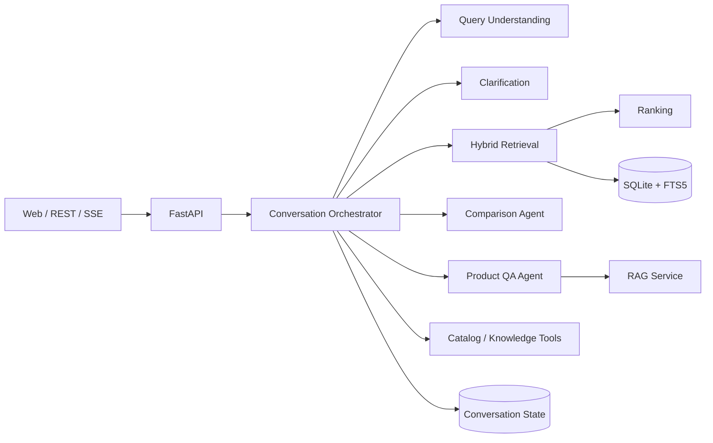
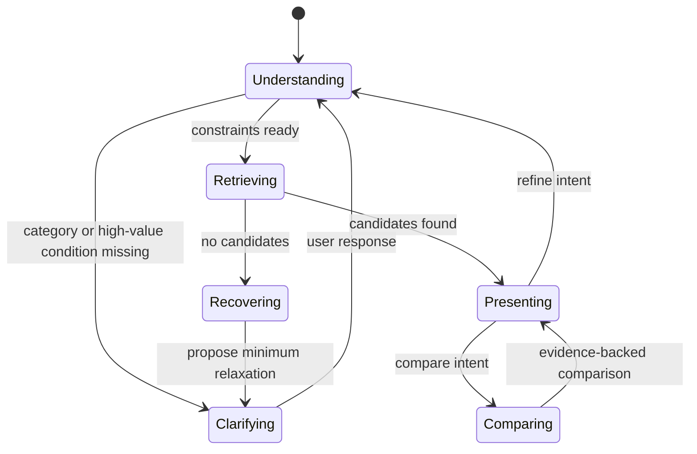

# ShopGuide Agent：多 Agent 与大模型应用架构

本文将设计规格对应到实际代码。项目采用“Agent 决策、Service 执行、Repository 持久化、Tool 提供受限能力”的边界；大模型是可替换的理解和生成组件，商品事实始终来自检索快照与证据。

## 1. 参考项目与电商模块映射

| 预约 Agent 参考模块 | ShopGuide 模块 | 代码入口 | 电商职责 |
| --- | --- | --- | --- |
| Task Classification Agent | Conversation Orchestrator | `agents/orchestrator.py` | 路由 SEARCH、REFINE、COMPARE、PRODUCT_QA、RESET |
| Appointment Agent | Product Search Agent | `Orchestrator.handle` | 提取约束、合并状态、澄清、检索与结果呈现 |
| Consultation Agent | Product QA Agent | `Orchestrator._qa` | 从知识证据或商品快照回答问题 |
| Technician Finder | Hybrid Retrieval Service | `services/hybrid_retrieval.py` | 硬过滤、BM25、向量召回和 RRF 融合 |
| Recommendation Service | Ranking Service | `services/ranking.py` | 可解释二阶段打分和品牌多样性控制 |
| User Behavior Agent | Preference/Event Service | `repositories/database.py` | 保存幂等事件与偏好表，供后续个性化排序 |
| Weather Tool | Catalog/Knowledge Tool | `tools/` | 只暴露声明明确、可验证的商品与知识访问能力 |

## 2. 多 Agent 架构与对话状态机





`ConversationState` 存在 `domain/models.py`，包含品类、硬过滤、软偏好、排除项、候选列表、已展示列表、待回答问题和乐观版本号。新值覆盖旧值；否定表达写入 `exclusions`；“便宜一点”按当前预算降低阈值；新商品品类会清空不兼容的旧搜索条件。

## 3. 需求理解与结构化约束 DSL

`domain/constraints.py` 定义 Pydantic 校验的 DSL，避免把自由文本直接交给数据库：

```json
{
  "category": "laptop",
  "must": [{"field": "price", "op": "lte", "value": 5000, "unit": "CNY"}],
  "should": [{"concept": "portable", "weight": 0.8}],
  "must_not": [{"field": "brand", "op": "eq", "value": "Apple"}],
  "use_cases": ["coding"]
}
```

当前离线模式由 `QueryUnderstandingService` 通过规则提取价格、重量、内存、续航、品牌、否定条件和使用场景；生产模式可由 `config/model_provider.py` 调用 OpenAI-compatible 模型，并必须先按该 Pydantic Schema 校验，再进入约束合并。模型不能产生未定义字段，也不能直接拼接 SQL。

## 4. 主动澄清与多轮修改

`ClarificationService` 每轮最多返回一个问题。它优先询问无法检索的品类、能显著缩小大候选集的预算，或笔记本场景的核心取舍。它不在已有高质量候选时逐字段盘问。

多轮状态由 `QueryUnderstandingService.merge` 合并：显式条件覆盖、排除条件累积、偏好去重、相对价格基于已有预算重算。零结果时 `RetrievalService.relaxation` 只建议放宽一个影响最大的条件，不会静默删除硬过滤。

## 5. BM25 + 向量 + RRF 混合召回

`HybridRetrievalService` 先用结构化硬过滤排除不合格商品，然后并行计算：

1. SQLite FTS5/BM25 关键词分数；
2. 离线哈希向量的余弦相似度，用于不配置 Embedding API 的本地语义召回；
3. Reciprocal Rank Fusion：`RRF(d) = Σ 1 / (60 + rank_i(d))`。

哈希向量只用于 Demo 的可运行基线。生产接入时，将 `_vector` 替换为 OpenAI、BGE 或其他 Embedding 模型，并把向量存到 pgvector、FAISS 或 Chroma；RRF 和硬过滤契约保持不变。

## 6. 可解释重排与零结果恢复

`RankingService` 在候选集上组合 RRF、语义、关键词、属性命中、评分、评论热度和库存。每个结果提供 `match_reasons`，例如“符合‘编程’需求”“价格在预算内”“重量符合要求”。最后限制同品牌的近似结果，避免 Top-K 被单一品牌占满。

硬条件只在召回前过滤，排序永远不会把不合格商品重新加入结果。没有结果时只输出可审计的最小放宽建议。

## 7. 商品问答、对比与防幻觉

- `RagService` 返回带 `id`、`source_type` 和可选 `product_id` 的 `EvidenceChunk`；当前内置术语库是一个可运行的 RAG 最小实现。
- `KnowledgeTool` 是 QA Agent 的唯一知识入口；生产化时替换内部检索器为向量库，接口不变。
- `CatalogTool` 只按真实 ID 返回商品快照；`Comparison Agent` 仅比较已展示或明确指定的 2–4 件商品。
- `ResponseValidator` 校验推荐商品和 `evidence_ids` 都属于当前快照或知识证据。找不到证据时，QA 返回“数据未提供”，不会补写商品事实。

## 8. 数据模型、Tool 与 API

SQLite 包含 `products`、`products_fts`、`conversations`、`user_events`、`user_preferences` 和 `knowledge_documents`。首版商品把 SPU、SKU、库存和属性作为快照 JSON 保存；生产环境可拆分为 PostgreSQL 商品/SKU 表和 pgvector 索引。

| Tool | 输入 | 输出 | 约束 |
| --- | --- | --- | --- |
| CatalogTool | product IDs | Product snapshots | 只返回真实 ID |
| KnowledgeTool | query, top_k | Evidence chunks | 每段有来源 ID |
| Event Repository | request ID, event | accepted | request ID 幂等 |

API 协议：`POST /api/v1/chat` 支持普通 JSON 或 SSE；`POST /api/v1/products/search` 用于调试检索；`POST /api/v1/products/compare` 返回结构化参数表；`POST /api/v1/events` 记录行为；管理端导入与索引重建接口使用 `x-admin-token` 鉴权。SSE 事件依次为 `status`、`products`、`delta`、`suggestions` 和 `done`。

## 9. 目录与技术选型

目录按 Web/API → Agents → Services → Tools/Repositories → SQLite 分层。当前技术栈是 Python 3.11、FastAPI、Pydantic v2、SQLite FTS5、原生 JavaScript 和 Pytest。面向大模型应用的扩展点包括：OpenAI-compatible Provider、Pydantic Structured Output、Embedding、向量库、Tool Calling、SSE、RAG 证据链和离线评测。

## 10. 五阶段计划与验收标准

| 阶段 | 已实现/后续 | 验收标准 |
| --- | --- | --- |
| 1. 领域与检索 | 已实现：120 商品、SQLite、FTS5、硬过滤 | 组合硬过滤不违规、结果可复现 |
| 2. 对话理解 | 已实现规则降级与状态合并；后续接入模型 Provider | 品类准确率 ≥95%，关键约束 F1 ≥0.90 |
| 3. 混合召回 | 已实现本地向量 + RRF；后续替换真实 Embedding | Recall@20、NDCG@5 优于 BM25 基线 |
| 4. QA/对比/前端 | 已实现最小 RAG、比较、SSE、Web Demo | 商品事实均有快照或 Evidence ID |
| 5. 工程化 | 已实现 Docker、测试、健康检查；后续追踪与缓存 | 一条命令启动、自动化评测、可观测性指标 |
