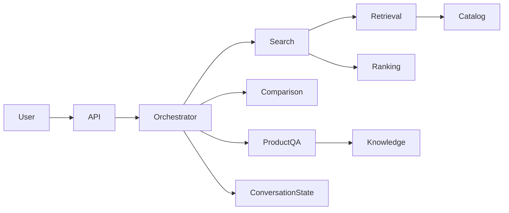
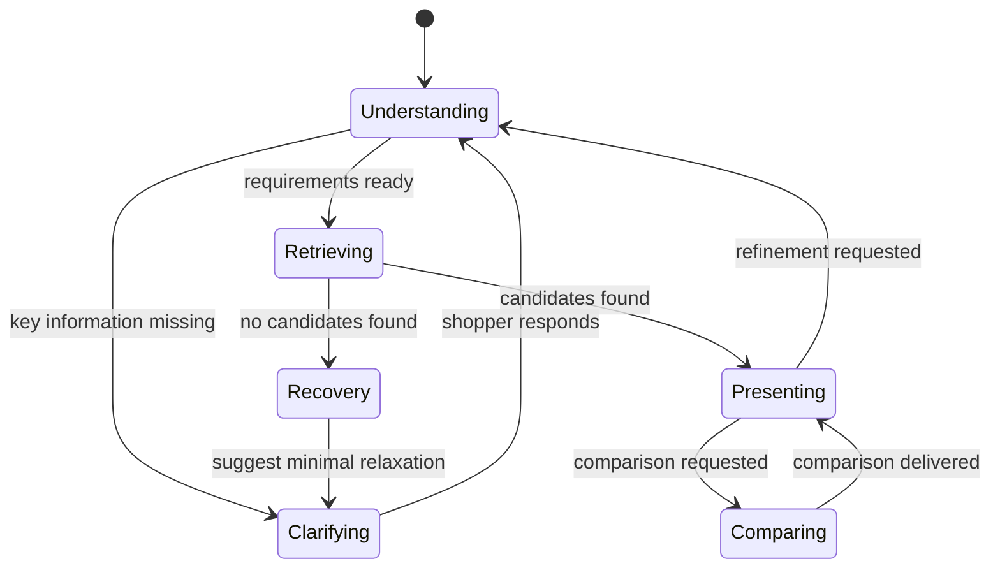

# ShopGuide Agent Architecture

## Reference Mapping

| Reference capability | ShopGuide capability | Purpose |
| --- | --- | --- |
| Task classification | Conversation orchestration | Select search, refinement, comparison, Q&A, feedback, or reset |
| Appointment collection | Product search | Understand requirements and maintain shopping constraints |
| Consultation | Product Q&A | Answer from product evidence and approved knowledge |
| Resource matching | Hybrid retrieval | Combine eligibility filtering, keyword search, and semantic search |
| Recommendation | Explainable ranking | Order candidates and explain the trade-offs |
| User behaviour | Preference and event tracking | Record session and long-term signals |
| External tools | Catalog and knowledge tools | Provide verified product facts and evidence |

## Conversation Flow





The assistant preserves category, hard constraints, soft preferences, exclusions, displayed products, and a pending clarification throughout a session. Explicit current-turn requirements always take priority over inferred preferences.

## Requirement Understanding

The assistant represents a shopping need as validated structured constraints. It separates non-negotiable requirements, such as maximum price or brand exclusion, from preferences such as portability or photo quality. An OpenAI-compatible inference API can produce the structured interpretation; the response is validated before it affects the search state.

```json
{
  "category": "laptop",
  "must": [{"field": "price", "op": "lte", "value": 5000, "unit": "CNY"}],
  "should": [{"concept": "portable", "weight": 0.8}],
  "must_not": [{"field": "brand", "op": "eq", "value": "Apple"}],
  "use_cases": ["coding"]
}
```

## Clarification and Refinement

The assistant asks at most one question at a time. It asks only when a missing category, budget, or preference would substantially improve the search. A refinement updates the existing shopping task: a new budget replaces the prior budget, an exclusion remains active, and “make it cheaper” adjusts the active price target. An empty result does not silently drop constraints; it proposes the smallest practical relaxation.

## Retrieval and Ranking

Eligible products are retrieved through structured filtering, BM25 keyword retrieval, and embedding-based semantic retrieval. Reciprocal Rank Fusion joins the retrieval lists before explainable ranking. Ranking considers semantic relevance, lexical relevance, matched attributes, product quality, popularity, availability, and diversity. Every result includes reasons that relate directly to the shopper's request.

## Grounded Q&A and Comparison

Product Q&A uses approved evidence chunks. Product facts such as price, stock, and specifications are obtained only from catalog snapshots. A comparison uses two to four products that the shopper has already seen or explicitly identified, then presents the same dimensions for each product. If evidence is missing, the assistant says that the information is not available.

## Data, Tools, and API

The application stores products, full-text search data, conversation state, events, preferences, and knowledge records. Tools provide bounded access to catalog snapshots and knowledge evidence. The API supports conversational JSON responses, Server-Sent Events, search debugging, comparison, events, session management, health checks, and protected catalogue import or index rebuild operations.

## Delivery Plan

| Phase | Outcome | Acceptance signal |
| --- | --- | --- |
| Foundation | Product model, catalogue, filters, and keyword retrieval | Hard constraints are never violated |
| Understanding | Structured requirements and multi-turn state | Category and constraint metrics meet the target set |
| Retrieval | Embeddings, RRF, and ranking | Retrieval and ranking improve over keyword baseline |
| Experience | Q&A, comparison, streaming UI | Facts are grounded in evidence |
| Operations | Evaluation, observability, and deployment | Repeatable startup and measurable quality |
