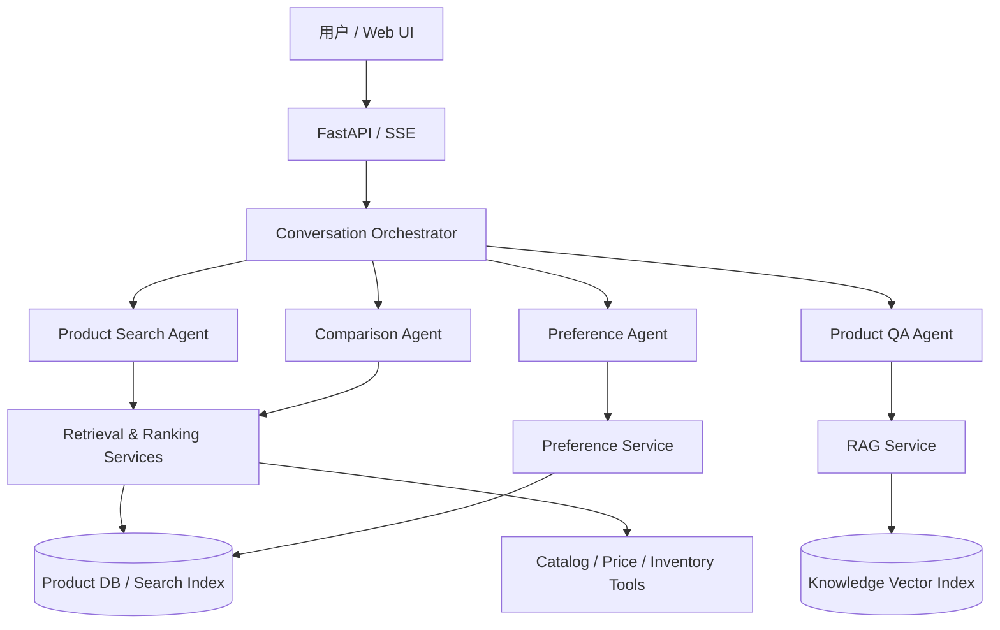
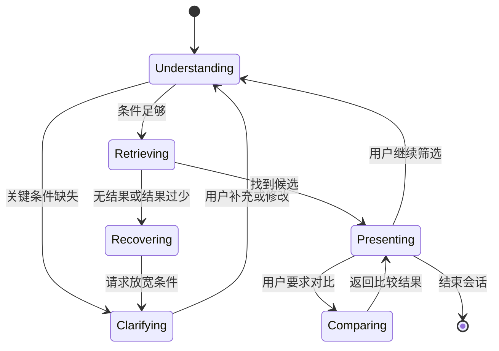

# ShopGuide Agent：电商商品检索对话系统设计与实现文档

> 基于 `jerry-ai-dev/smart-appointment-ai-agent` 的工程思想重新设计。本文是项目设计与开发规格，可直接作为个人项目立项文档、Codex 开发任务书和面试讲解材料。

## 1. 项目概述

### 1.1 项目名称

**ShopGuide Agent（智购导购 Agent）**

### 1.2 项目目标

构建一个面向电商平台的多轮商品检索对话系统。用户不需要准确输入商品名或复杂筛选条件，只需像与导购交流一样描述需求，例如：

> 我想买一台 5000 元以内、适合写代码、偶尔剪视频的轻薄笔记本，不要太重。

系统通过多轮对话完成：

1. 识别搜索、咨询、对比、推荐等意图；
2. 从自然语言中提取预算、品牌、品类、属性、使用场景等约束；
3. 判断信息是否足够，并只追问对检索结果影响最大的缺失条件；
4. 通过关键词、向量和结构化过滤进行混合检索；
5. 对候选商品重排，返回有依据的推荐和差异说明；
6. 根据用户反馈修改约束，而不是每轮重新搜索；
7. 记录点击、收藏、对比等行为，形成可解释的长期偏好。

### 1.3 项目边界

首版聚焦“检索与决策辅助”，不直接实现支付、真实订单和库存扣减。

包含：商品搜索、条件澄清、筛选、推荐、对比、商品知识问答、会话偏好、反馈记录。

不包含：支付、履约、售后工单、真实推荐广告竞价、跨店铺结算。

### 1.4 项目亮点

- **Agent 负责流程决策，检索引擎负责找商品**：避免让大模型记忆或虚构商品。
- **结构化约束与语义需求分离**：价格、品牌等走数据库过滤，“适合通勤”“拍照好”走语义召回。
- **可恢复的多轮状态**：支持“便宜一点”“第二个和小米那款比较”“不要游戏本”等上下文修改。
- **主动澄清策略**：不是固定字段填表，而是根据候选集大小和排序不确定性选择下一问。
- **混合召回与可解释重排**：BM25/全文检索、向量检索、业务规则和个性化信号组合。
- **结果证据化**：回答中的价格、配置、库存、评分必须来自检索快照，不允许模型自行补全。
- **离线可运行**：提供 SQLite/FTS5 和模拟商品数据；配置模型后可启用 LLM 与 Embedding。

---

## 2. 对参考项目的继承与重构

参考项目采用 Web、API、Agents、Services、DB 五层结构，并通过任务分类 Agent 将请求路由到预约、咨询和用户行为模块。本项目继承其清晰分层与多 Agent 解耦思路，但对核心业务链路做如下替换。

| 参考项目模块 | 本项目模块 | 变化说明 |
|---|---|---|
| Task Classification Agent | Conversation Orchestrator | 从单标签意图分类升级为“意图 + 当前状态 + 工具计划” |
| Appointment Agent | Product Search Agent | 从收集预约字段改为维护商品检索约束与候选集 |
| Consultation Agent | Product QA Agent | RAG 内容从服务知识改为商品详情、参数解释、政策问答 |
| Technician Finder | Hybrid Retrieval Service | 从技师条件匹配改为结构化过滤与混合召回 |
| Recommendation Service | Ranking Service | 从简单调度扩展为候选商品打分和重排 |
| User Behavior Agent | Preference Agent | 从行为统计扩展为会话偏好、长期偏好及负反馈 |
| Technician/Schedule | Product/SKU/Inventory | 商品、SKU、库存、价格快照取代技师与排班 |
| Weather Tool | Catalog/Price/Inventory Tools | 外部信息改为商品目录、实时价格与库存工具 |

### 不直接照搬的设计

1. 不把完整聊天历史直接拼入每个 Prompt，而使用结构化 `ConversationState`。
2. 不依赖 LLM 输出自由格式 JSON，使用 Pydantic Schema 校验并设置重试/降级。
3. 不让 Agent 直接访问数据库，所有数据访问继续经过 Service 和 Repository。
4. 不把内部思维过程输出给用户，只输出可审计的操作摘要和商品证据。
5. 不将“推荐”写成一个空的后台任务，而实现明确、可测试的排序公式。

---

## 3. 用户场景与核心用例

### 3.1 需求模糊的探索式搜索

用户：“想买个送妈妈的手机，拍照好，操作简单。”

系统行为：识别手机品类与人群场景；检索候选；发现预算对结果影响最大；追问预算；根据回答更新约束并推荐。

### 3.2 明确条件检索

用户：“找 300 元以下、降噪、续航 30 小时以上的蓝牙耳机。”

系统行为：直接执行价格和续航硬过滤，同时对“降噪”做属性/语义召回，不做无价值追问。

### 3.3 多轮条件修正

用户：“不要入耳式，预算可以加到 500。”

系统行为：在原检索状态上增加排除条件、更新价格上限并重新检索。

### 3.4 商品对比

用户：“第二个和索尼那款哪个好？”

系统行为：解析指代，锁定两个商品；按用户当前使用场景生成参数对比和取舍建议。

### 3.5 商品咨询

用户：“IP68 是什么意思？下雨天能用吗？”

系统行为：读取商品参数和知识库文档；区分厂商声明与通用解释；给出带来源的回答。

### 3.6 零结果恢复

用户提出互相冲突或过严条件时，系统不返回空白，而是说明冲突条件，并提供最小放宽方案，例如“将预算从 300 元放宽到 379 元可增加 4 款候选”。

---

## 4. 总体架构



### 4.1 分层约束

```text
Web/Application → API → Agents → Services → Repositories/DB
```

- Web 只负责交互与流式展示。
- API 负责鉴权、参数校验、会话创建和响应协议。
- Agent 负责决定下一步，不实现 SQL、索引和打分细节。
- Service 实现检索、排序、状态合并、RAG、偏好计算。
- Repository 封装 SQLite/PostgreSQL、全文索引与向量库。

---

## 5. Agent 设计

### 5.1 Conversation Orchestrator

职责：结合用户本轮输入和当前会话状态，选择下一动作。

意图集合：

- `SEARCH`：搜索或推荐商品；
- `REFINE`：修改已有搜索条件；
- `COMPARE`：对比候选商品；
- `PRODUCT_QA`：询问商品参数、规则或概念；
- `FEEDBACK`：喜欢、不喜欢、收藏、忽略；
- `RESET`：开始新的购物任务；
- `OUT_OF_SCOPE`：超出系统范围。

Orchestrator 输出固定 Schema：

```json
{
  "intent": "SEARCH",
  "confidence": 0.94,
  "target_agent": "product_search",
  "referenced_product_ids": [],
  "should_preserve_search_state": true
}
```

路由首先使用规则处理高置信指令（“清空条件”“比较 1 和 3”），其余请求再交给 LLM 分类。置信度过低时，不猜测业务动作，而是追问用户。

### 5.2 Product Search Agent

职责：管理需求理解、澄清、检索和结果呈现，是项目核心 Agent。

处理步骤：

1. 调用 Query Understanding Service 提取本轮约束；
2. 与旧状态合并，识别新增、修改和删除条件；
3. 判断是否存在条件冲突；
4. 估算候选集与不确定性，决定追问或检索；
5. 调用 Hybrid Retrieval Service 获取候选；
6. 调用 Ranking Service 重排；
7. 生成基于候选快照的回答和快捷操作建议。

### 5.3 Product QA Agent

处理两类问题：

- **商品事实问题**：价格、参数、颜色、库存等，只读取结构化商品数据和实时工具结果；
- **知识解释问题**：OLED、IP68、主动降噪等，从知识库 RAG 检索后回答。

回答必须带 `evidence_ids`。检索证据不足时明确说明未知，不能根据常识补写特定商品事实。

### 5.4 Comparison Agent

输入为 2～4 个商品 ID、当前用户约束和商品快照。输出：

- 同一维度的参数表；
- 与当前需求最相关的关键差异；
- 每个商品的适合/不适合人群；
- 有条件的选择结论，如“重视便携选 A，重视续航选 B”。

### 5.5 Preference Agent

记录显式和隐式反馈，但区分作用域：

- 会话偏好：本次只看轻薄本；
- 长期偏好：经常选择某品牌；
- 强负偏好：明确说“不要曲面屏”；
- 弱行为信号：点击、停留、收藏。

长期偏好不得自动覆盖本轮明确约束。个性化信号只影响软排序，不参与库存、价格等硬条件过滤。

---

## 6. 对话状态与状态机

### 6.1 ConversationState

```python
class ConversationState(BaseModel):
    session_id: str
    user_id: str | None
    intent: str
    stage: str
    query_text: str | None
    category: str | None
    hard_filters: dict
    soft_preferences: list
    exclusions: list
    use_cases: list
    sort_preference: str | None
    candidate_product_ids: list[str]
    displayed_product_ids: list[str]
    pending_question: dict | None
    turn_count: int
    version: int
```

字段示例：

```json
{
  "category": "laptop",
  "hard_filters": {
    "price_max": 5000,
    "weight_max_kg": 1.6,
    "memory_gb_min": 16
  },
  "soft_preferences": [
    {"name": "适合编程", "weight": 0.9},
    {"name": "偶尔剪视频", "weight": 0.6}
  ],
  "exclusions": ["gaming_laptop"]
}
```

### 6.2 状态机



### 6.3 状态更新规则

- 本轮明确值覆盖旧值，如“预算改成 6000”。
- 否定表达加入 exclusions，如“不要苹果”。
- “便宜一点”属于相对修改，应基于当前价格区间生成新阈值。
- 新品类出现时提示是否开启新搜索，避免手机条件污染耳机检索。
- 每次写入使用 `version` 做乐观锁，防止并发请求覆盖。

---

## 7. Query Understanding 设计

### 7.1 提取 Schema

```json
{
  "category": "laptop",
  "must": [
    {"field": "price", "op": "lte", "value": 5000, "unit": "CNY"}
  ],
  "should": [
    {"concept": "portable", "weight": 0.8}
  ],
  "must_not": [
    {"field": "product_type", "op": "eq", "value": "gaming_laptop"}
  ],
  "use_cases": ["coding", "light_video_editing"],
  "sort": null,
  "references": [],
  "ambiguities": ["screen_size"]
}
```

### 7.2 规范化

- “五千左右”规范化为目标价 5000 和可配置容差区间；
- “一斤以内”转换为 0.5 kg；
- 品牌别名归一化，如“苹果电脑”映射到 `Apple` + `laptop`；
- 属性同义词映射，如“运行内存”映射到 `memory_gb`；
- 相对词结合上下文处理，如“再轻一点”基于当前候选重量分布设阈值。

LLM 只提取候选结构，最终字段、类型、枚举、单位由规则校验器确认。不存在于 Catalog Schema 的字段不能直接转为过滤条件，可作为语义偏好保留。

---

## 8. 主动澄清策略

固定逐项追问会让系统像表单。这里采用“信息增益 + 业务价值”的澄清策略。

### 8.1 何时追问

- 无法确定商品品类；
- 硬条件互相冲突；
- 候选数超过上限且排序分数非常接近；
- 某个缺失属性能显著缩小候选集；
- 高风险偏好需要确认，例如二手/翻新、进口版本。

如果已经有高质量 Top-K，不因非关键字段缺失而追问，直接给结果并提供进一步筛选选项。

### 8.2 下一问题评分

对可追问属性 `a`：

```text
question_score(a) = 0.45 * expected_information_gain
                  + 0.30 * user_relevance
                  + 0.15 * ranking_uncertainty_reduction
                  - 0.10 * interaction_cost
```

每轮最多问一个主问题，并提供 2～4 个可选答案，例如：“更看重便携、性能，还是续航？”

---

## 9. 商品检索与排序

### 9.1 两阶段检索

#### 阶段一：候选召回

并行执行：

1. **结构化过滤**：品类、价格、品牌、规格、库存；
2. **关键词召回**：商品名、卖点、属性，首版使用 SQLite FTS5/BM25；
3. **向量召回**：对用途和自然语言偏好做语义检索；
4. **热门兜底**：仅在召回不足时，补充同品类高质量商品。

合并时使用 Reciprocal Rank Fusion：

```text
RRF(d) = Σ 1 / (k + rank_i(d)), k 默认 60
```

#### 阶段二：重排

首版使用可解释打分，不强依赖大模型：

```text
final_score = 0.30 * semantic_score
            + 0.20 * lexical_score
            + 0.20 * attribute_match
            + 0.10 * quality_score
            + 0.10 * popularity_score
            + 0.10 * personalization_score
            - penalties
```

`penalties` 包括软条件违背、信息缺失、低库存、重复款式等。硬条件不满足的商品在召回阶段直接剔除。

### 9.2 多样性控制

使用 MMR 或简单品类/品牌去重，避免 Top-5 全是同品牌近似 SKU：

```text
MMR = λ * relevance - (1-λ) * max_similarity_to_selected
```

### 9.3 零结果恢复

1. 识别造成零结果的约束；
2. 按“用户强调程度、约束类型、放宽成本”排序；
3. 每次只提出最小放宽建议；
4. 未经用户确认，不静默删除硬条件。

---

## 10. RAG 与答案可信度

### 10.1 知识来源

- 商品标题、属性和 SKU 数据；
- 商品详情与官方说明；
- 平台配送、退换、保修政策；
- 术语知识库；
- 用户评价摘要（必须标记为用户观点）。

### 10.2 索引粒度

- 每个 SKU 的结构化属性不切块，直接查询；
- 商品详情按标题层级切块；
- 平台政策按条款切块；
- 每个 chunk 保存 `source_type`、`product_id`、`updated_at`、`version`。

### 10.3 防幻觉约束

- 商品事实必须存在于本轮 `ProductSnapshot`；
- 价格和库存带查询时间；
- 找不到依据时返回“当前商品数据未提供该参数”；
- Prompt 不允许模型生成候选集中不存在的商品 ID；
- Response Validator 检查回答中的价格、商品名和 ID 是否与快照一致。

---

## 11. 数据模型

### 11.1 核心表

#### products

| 字段 | 类型 | 说明 |
|---|---|---|
| id | string | 商品 SPU ID |
| title | string | 商品标题 |
| category_id | string | 品类 |
| brand | string | 品牌 |
| description | text | 商品描述 |
| attributes | JSON | 规范化属性 |
| tags | JSON | 场景及卖点标签 |
| rating | float | 评分 |
| review_count | int | 评论数 |
| status | string | active/inactive |

#### skus

| 字段 | 类型 | 说明 |
|---|---|---|
| id | string | SKU ID |
| product_id | string | SPU ID |
| variant_attributes | JSON | 颜色、容量等 |
| price | decimal | 当前价 |
| list_price | decimal | 标价 |
| currency | string | 币种 |
| stock | int | 可售库存 |
| updated_at | datetime | 快照更新时间 |

#### conversations / messages

保存会话、角色、消息、意图、状态版本、调用耗时与 trace ID。原始消息和结构化状态分开存储。

#### user_events

保存 `impression`、`click`、`compare`、`favorite`、`add_to_cart`、`dislike` 等事件，包含商品、位置、会话及时间。

#### user_preferences

保存偏好字段、值、权重、来源、作用域、置信度和更新时间。

#### knowledge_documents

保存知识块、来源、绑定商品、版本、向量索引键和生效状态。

---

## 12. Tool 设计

Agent 只能调用声明明确、输入输出可校验的工具。

```python
search_products(query, filters, top_k) -> SearchResult[]
get_product_details(product_ids) -> ProductSnapshot[]
get_price_and_inventory(sku_ids) -> RealtimeSkuSnapshot[]
compare_products(product_ids, dimensions) -> ComparisonData
retrieve_knowledge(query, product_ids, top_k) -> EvidenceChunk[]
record_user_event(user_id, event) -> Ack
```

工具约束：

- 搜索工具只能返回真实存在的 ID；
- 实时工具失败时回退到缓存并标记 `stale=true`；
- 写操作必须幂等，携带 `request_id`；
- 日志不记录 API Key 和完整用户隐私字段；
- 设置超时、重试、熔断和并发限制。

---

## 13. API 设计

### 13.1 对话接口

`POST /api/v1/chat`

```json
{
  "session_id": "optional-session-id",
  "user_id": "optional-user-id",
  "message": "5000 元以内适合编程的轻薄本",
  "stream": true
}
```

SSE 事件类型：

```text
event: status      data: {"stage":"retrieving"}
event: products    data: {"items":[...]}
event: delta       data: {"text":"我筛选出..."}
event: suggestions data: {"items":["只看 14 英寸","更便宜"]}
event: done        data: {"trace_id":"..."}
event: error       data: {"code":"RETRIEVAL_TIMEOUT"}
```

### 13.2 其他接口

- `GET /api/v1/sessions/{id}`：获取会话状态；
- `DELETE /api/v1/sessions/{id}`：重置会话；
- `POST /api/v1/products/search`：调试检索链路；
- `POST /api/v1/products/compare`：结构化比较；
- `POST /api/v1/events`：记录用户行为；
- `POST /api/v1/admin/products/import`：导入演示商品数据；
- `POST /api/v1/admin/index/rebuild`：重建索引；
- `GET /health` 与 `GET /ready`：运行和依赖健康检查。

---

## 14. 推荐项目目录

```text
shopguide-agent/
├── app.py
├── pyproject.toml
├── .env.example
├── README.md
├── config/
│   ├── settings.py
│   ├── model_provider.py
│   └── logging.py
├── api/
│   ├── chat.py
│   ├── products.py
│   ├── events.py
│   └── schemas.py
├── agents/
│   ├── orchestrator.py
│   ├── product_search_agent.py
│   ├── product_qa_agent.py
│   ├── comparison_agent.py
│   └── preference_agent.py
├── domain/
│   ├── conversation_state.py
│   ├── search_constraints.py
│   ├── product.py
│   └── events.py
├── services/
│   ├── query_understanding.py
│   ├── constraint_merger.py
│   ├── clarification.py
│   ├── hybrid_retrieval.py
│   ├── ranking.py
│   ├── comparison.py
│   ├── rag.py
│   └── response_validator.py
├── tools/
│   ├── catalog_tool.py
│   ├── price_inventory_tool.py
│   └── knowledge_tool.py
├── repositories/
│   ├── product_repository.py
│   ├── conversation_repository.py
│   ├── preference_repository.py
│   └── knowledge_repository.py
├── db/
│   ├── models.py
│   ├── session.py
│   └── migrations/
├── data/
│   ├── demo_products.json
│   └── knowledge/
├── web/
│   ├── templates/
│   └── static/
├── evals/
│   ├── query_cases.jsonl
│   ├── conversation_cases.jsonl
│   └── evaluator.py
└── tests/
    ├── unit/
    ├── integration/
    └── e2e/
```

---

## 15. 技术选型

### 15.1 MVP

- Python 3.11+
- FastAPI + Uvicorn
- Pydantic v2
- SQLAlchemy 2 + SQLite
- SQLite FTS5（关键词搜索）
- FAISS 或 Chroma（向量搜索）
- LangChain 仅用于模型/工具适配；业务状态自己管理
- Jinja2 + 原生 JavaScript（演示前端）
- Pytest + pytest-asyncio

### 15.2 生产化替换

- PostgreSQL + pgvector 或 Elasticsearch/OpenSearch；
- Redis 保存短期会话、缓存和分布式锁；
- Kafka/消息队列处理行为事件；
- OpenTelemetry + Prometheus 做链路与指标监控；
- 对象存储保存知识文档；
- 商品服务、价格服务、库存服务通过内部 API/MCP Tool 接入。

首版不建议为了“多 Agent”引入复杂图编排框架。状态分支明显增多后，再将 Orchestrator 迁移到 LangGraph。

---

## 16. 核心流程伪代码

```python
async def handle_turn(message, state):
    route = await orchestrator.route(message, state)

    if route.intent in {"SEARCH", "REFINE"}:
        parsed = await query_understanding.extract(message, state)
        state = constraint_merger.merge(state, parsed)

        conflicts = constraint_validator.find_conflicts(state)
        if conflicts:
            return build_conflict_question(conflicts), state

        probe = await retrieval_service.estimate(state)
        question = clarification_service.select_question(state, probe)
        if question:
            state.pending_question = question
            return question, state

        candidates = await retrieval_service.search(state)
        if not candidates:
            relaxation = relaxation_service.propose(state)
            return build_relaxation_response(relaxation), state

        ranked = ranking_service.rank(candidates, state)
        diversified = ranking_service.diversify(ranked)
        snapshots = await product_service.freeze_snapshots(diversified[:5])
        response = await response_builder.build(state, snapshots)
        response_validator.validate(response, snapshots)
        state.displayed_product_ids = [x.product_id for x in snapshots]
        return response, state

    if route.intent == "COMPARE":
        ids = reference_resolver.resolve(message, state.displayed_product_ids)
        return await comparison_agent.run(ids, state), state

    if route.intent == "PRODUCT_QA":
        return await product_qa_agent.run(message, state), state
```

---

## 17. 实现阶段与验收标准

### Phase 1：领域模型与基础检索

任务：

- 建立 Product、SKU、ConversationState、SearchConstraint 模型；
- 准备至少 100 条、3 个品类的演示商品；
- 实现 SQLite Repository、结构化过滤和 FTS5；
- 实现确定性排序和 `/products/search` 接口。

验收：价格、品牌、属性组合过滤正确率 100%；同一输入结果可复现；无 LLM 时也能运行。

### Phase 2：对话需求理解

任务：

- 实现意图分类、结构化约束提取和 Pydantic 校验；
- 实现状态合并、否定条件、相对修改和指代解析；
- 实现澄清策略和零结果恢复。

验收：预置 50 条查询的品类识别准确率 ≥ 95%，关键约束 F1 ≥ 0.90；20 组多轮案例状态更新通过。

### Phase 3：混合召回与重排

任务：

- 为商品描述生成向量；
- 实现关键词 + 向量并行召回、RRF 融合；
- 实现业务打分、个性化加权和多样性控制；
- 返回逐项 match reasons。

验收：离线标注集 Recall@20、NDCG@5 优于纯关键词基线；硬条件违规率为 0。

### Phase 4：商品 QA、对比与前端

任务：

- 建立商品详情/术语/政策知识索引；
- 实现 Product QA 和 Comparison Agent；
- 实现 SSE 流式接口和商品卡片前端；
- 支持快捷追问、继续筛选、加入对比。

验收：所有商品事实可追溯到快照或证据；不存在候选外商品；核心 E2E 场景全部通过。

### Phase 5：评测与工程化

任务：

- 增加结构化日志、trace、缓存、超时与降级；
- 建立自动化离线评测；
- Docker 化；
- 编写 README、架构图、演示脚本与接口文档。

验收：本地一条命令启动；测试覆盖率建议 ≥ 80%；无外部模型时可运行规则降级 Demo。

---

## 18. 测试方案

### 18.1 单元测试

- 单位和价格区间规范化；
- 约束新增、覆盖、删除、否定；
- 相对条件更新；
- 排序公式与硬过滤；
- 指代解析；
- 回答事实校验器；
- 零结果约束放宽排序。

### 18.2 集成测试

- Query Understanding → 状态合并 → 检索 → 重排；
- 商品 QA → RAG → 证据校验；
- Tool 超时后的缓存降级；
- 多会话数据隔离；
- 索引更新后新商品可检索、下架商品不可检索。

### 18.3 E2E 对话样例

```text
用户：想买个 5000 以下写代码的笔记本
系统：筛出候选，并询问更重视便携还是性能
用户：便携，最好 1.5kg 以下
系统：更新重量硬条件并返回 3 款
用户：第二个和第三个比一下
系统：正确解析指代并按重量、CPU、内存、续航、价格对比
用户：还是想便宜一点，不要联想
系统：保留品类/用途/重量，降低价格偏好并排除品牌
```

### 18.4 离线指标

| 模块 | 指标 |
|---|---|
| 意图路由 | Accuracy、Macro-F1 |
| 约束提取 | Slot Precision/Recall/F1 |
| 召回 | Recall@10、Recall@20 |
| 排序 | NDCG@5、MRR |
| 条件遵守 | Hard Constraint Violation Rate |
| 回答可信度 | Grounded Fact Rate |
| 多轮状态 | State Update Accuracy |
| 性能 | P50/P95 延迟、Tool 错误率 |

---

## 19. 安全、隐私与工程注意事项

- 商品描述、评价和知识文档都视为不可信输入，防止 Prompt Injection；
- 检索文本不能改变系统指令或触发未授权工具；
- 用户画像只保存业务必要字段，并支持删除；
- 日志脱敏，不记录 Token、手机号、地址等；
- 价格和库存回答显示快照时间，失败时不承诺可购买；
- 推荐理由不得包含敏感属性推断；
- 给管理端导入和重建索引接口增加鉴权；
- 所有模型输出通过 Schema Validator，失败后最多重试一次，再走规则降级。

---

## 20. 面试讲解重点

可以按下面四句话说明项目价值：

1. “我没有把它做成套壳聊天机器人，而是将对话理解、结构化过滤、语义召回和重排拆成可评测链路。”
2. “Agent 的价值是管理多轮状态、决定追问或调用哪个工具；商品真实性由检索与工具结果保证。”
3. “系统同时解决了模糊需求、条件修正、指代比较和零结果恢复，这是普通搜索框难以覆盖的交互。”
4. “我为每个环节设计了离线指标，能够用实验比较纯 BM25、向量检索和混合检索，而不是只展示 Demo。”

### 相比参考项目的个人创新

- 从简单意图路由升级为基于状态的 Orchestrator；
- 从固定必填字段追问升级为信息增益澄清；
- 新增结构化约束 DSL 和状态合并机制；
- 新增 BM25 + Vector + RRF + 可解释重排；
- 新增零结果最小放宽、指代消解和多商品比较；
- 新增商品事实快照和 Response Validator 防幻觉；
- 新增端到端检索评测体系。

---

## 21. MVP 完成定义（Definition of Done）

项目达到以下条件即可作为完整求职作品：

- 至少支持笔记本、手机、耳机 3 个品类和 100 条商品；
- 支持搜索、条件修改、澄清、对比、知识问答 5 类对话；
- 支持价格、品牌、至少 5 类品类属性的硬过滤；
- 支持关键词与向量混合检索；
- 每个推荐结果包含匹配理由、价格/库存快照和可追溯商品 ID；
- 完成 20 组多轮 E2E 测试与一组离线检索评测；
- 提供 Web Demo、OpenAPI 文档、架构图、Dockerfile 和启动说明；
- 没有模型 API Key 时能以规则 + FTS5 模式演示核心流程。

## 22. 后续扩展

- 使用 Learning-to-Rank 训练重排器；
- 根据点击/收藏数据做上下文 Bandit；
- 接入图片搜索，支持“找和这张图类似的商品”；
- 接入真实 Elasticsearch/OpenSearch 与商品中心；
- 增加购物车 Agent，但将加入购物车设计为需要用户确认的写操作；
- 增加 A/B 实验，比较固定澄清与信息增益澄清对转化和轮次的影响；
- 用 LangGraph 显式化复杂状态节点，并增加可恢复 checkpoint。

---

## 参考项目

- GitHub：<https://github.com/jerry-ai-dev/smart-appointment-ai-agent>
- 借鉴内容：FastAPI、Agent/Service/DB 分层、任务路由、RAG、会话状态和用户行为模块。
- 重构原则：复用架构思想，不复制按摩预约业务代码；商品检索采用独立的数据模型、检索算法与评测体系。
